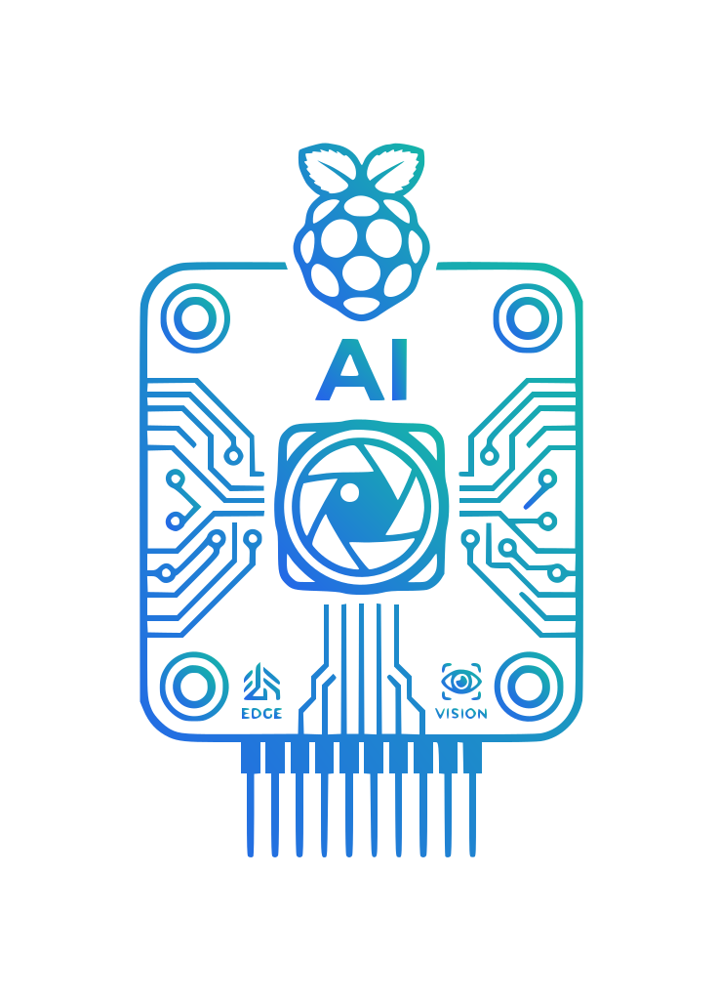

<!--
This document introduces Phenocam Vision Edge and owns the supported release
installation path. Detailed operation and development guidance live in docs/.
-->

<p align="center">
  
</p>

# Phenocam Vision Edge

[](https://github.com/e-tufarini-terrasystem/phenocam-vision-edge/actions/workflows/ci.yml)

Phenocam Vision Edge detects people and vehicles in local PhenoCam images with
the included YOLO26n ONNX model. It runs directly on a Raspberry Pi without
sending images to an external service and produces annotated images,
privacy-blurred images, or both. It can also delete an input after an enabled
class is detected.

## Why Phenocam Vision Edge?

- Designed for a Raspberry Pi 3 with 1 GB RAM; the earlier runtime was tested
  on that hardware. The current experimental model awaits target-device qualification.
- Uses only NumPy, ONNX Runtime, and Pillow on the deployment device.
- Processes images sequentially to keep resource ownership predictable.
- Evaluates one full image and fifteen adaptive overlapping crops for each input.
- Keeps output classes explicit through one fixed configuration file.

Phenocam Vision Edge is a focused single-image runtime, not a general-purpose
object-detection or model-training framework.

## Experimental release v0.2.0

The current source tree maintains **YOLO26n specialized for PhenoCam**, at
`models/yolo26n-phenocam.onnx`. This is the unchanged former v6 artifact;
its experimental acceptance status and measured limitations remain recorded in
`models/yolo26n-phenocam.json`, included in the runtime archive. Its training
acceptance criteria were not all met and an overall improvement was not
demonstrated. This release is intended for evaluation; Raspberry Pi qualification
of this exact version is pending.
After installing v0.2.0 below or following the [manual source setup](docs/manual.md), run:

```sh
.venv/bin/python -m phenocam --input input/example.jpg \
  --annotated-output output/example_annotated.jpg \
  --model models/yolo26n-phenocam.onnx
```

## Supported environments

| Use | Platform | Python | Scope |
|---|---|---|---|
| Stable `v0.1.0` | Raspberry Pi OS 64-bit (`aarch64`) | 3.11 or newer | Frozen release contract |
| Experimental `v0.2.0` | Raspberry Pi OS 64-bit (`aarch64`) | 3.13 | Target-device qualification pending |
| Current `main` | Raspberry Pi OS 64-bit (`aarch64`) | 3.13 | Deployment target |
| Current `main` | macOS on Apple Silicon | 3.13 | Manual source setup |
| CI | Ubuntu x86-64 | 3.13 | Tests and shell syntax only |

The CI badge does not qualify Raspberry Pi hardware. See the
[development guide](docs/development.md) for the complete verification scope.

## Quick install: experimental v0.2.0

The versioned installer requires Raspberry Pi OS 64-bit, Python 3.13
with `python3-venv`, and `curl`, `tar`, and `sha256sum`.

Install the operating-system prerequisites separately before installing the
application. The versioned command below never invokes `sudo`, `apt`, or another
system package manager. The release downloads are public and require no GitHub
account or token. Run the command from the parent directory where you want to
create `phenocam-vision-edge-0.2.0/`; that installation directory must not already
exist:

### Versioned installation (v0.2.0)

```sh
[ ! -e phenocam-vision-edge-0.2.0 ] && \
curl --fail --fail-early --location --silent --show-error \
  --output phenocam-vision-edge-0.2.0.tar.gz \
  https://github.com/e-tufarini-terrasystem/phenocam-vision-edge/releases/download/v0.2.0/phenocam-vision-edge-0.2.0.tar.gz \
  --output phenocam-vision-edge-0.2.0.tar.gz.sha256 \
  https://github.com/e-tufarini-terrasystem/phenocam-vision-edge/releases/download/v0.2.0/phenocam-vision-edge-0.2.0.tar.gz.sha256 && \
sha256sum -c phenocam-vision-edge-0.2.0.tar.gz.sha256 && \
tar -xzf phenocam-vision-edge-0.2.0.tar.gz && \
./phenocam-vision-edge-0.2.0/scripts/installer.sh
```

Success leaves the configured application at
`./phenocam-vision-edge-0.2.0/`, including the ONNX model, `.venv/`, `input/`,
and `output/`. The archive and checksum remain in the current directory. The
checksum detects corruption or a mismatched download; it is not a publisher
signature.

## First inference

Copy an image into the installation and request both output products:

```sh
cd phenocam-vision-edge-0.2.0
cp /path/to/image.jpg input/example.jpg
.venv/bin/python -m phenocam \
  --input input/example.jpg \
  --annotated-output output/example_annotated.jpg \
  --privacy-output output/example_privacy.jpg \
  --model models/yolo26n-phenocam.onnx
```

The command leaves the source image unchanged. See the
[CLI guide](docs/cli.md) for metadata, batch processing, thread control, and
conditional input deletion.

## Outputs and deletion safety

| Result | Option | Behavior |
|---|---|---|
| Annotated image | `--annotated-output` | Draws enabled detections and labels. |
| Privacy image | `--privacy-output` | Blurs expanded regions without labels. |
| Detection metadata | `--meta` | Atomically updates an existing `.meta` file. |
| Conditional deletion | `--delete-input-on-detection` | Removes the input only after an enabled final detection and all requested products succeed. |

Deletion is disabled by default. At least one image output or conditional
deletion is required; metadata alone is not a final action.

## Releases and main

The installation command above targets the experimental `v0.2.0` prerelease,
a frozen snapshot associated with its annotated tag. The previous
[stable v0.1.0 release](https://github.com/e-tufarini-terrasystem/phenocam-vision-edge/releases/tag/v0.1.0)
remains available with its original model and installation requirements.
The `main` branch contains ongoing development. Release claims and verification
apply only to the exact tagged commit.

## Documentation

- [Software operation instructions and CLI reference](docs/cli.md)
- [Manual installation and configuration](docs/manual.md)
- [Development, verification, and model export](docs/development.md)
- [Training dataset composition and reproducible builder](dataset/README.md)
- [Single specialized-model training workflow](docs/development.md#current-workflow)

## Support and license

Use [GitHub Issues](https://github.com/e-tufarini-terrasystem/phenocam-vision-edge/issues)
to report a reproducible problem or request clarification. Phenocam Vision Edge
is available under the [Apache License 2.0](LICENSE).
