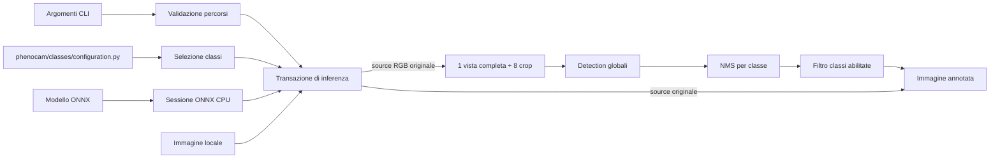
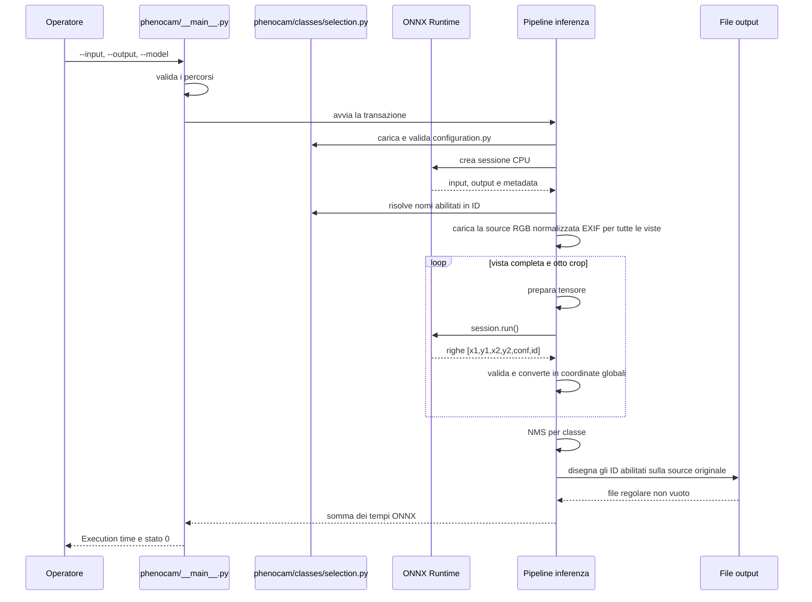

<!--
Scopo: descrivere la struttura statica e il flusso complessivo del software.
Responsabilita: definire componenti, errori e invarianti tra moduli.
Contesto: collega l'interfaccia CLI alla pipeline dettagliata in inferenza.md.
-->

# Architettura

## Modello del sistema

Il software e un processo sincrono e headless che trasforma un'immagine locale
in una nuova immagine annotata. Ogni invocazione gestisce esattamente un input,
un modello e un output. Non mantiene stato tra processi e non usa rete, database,
code, worker o inferenze parallele.

L'invariante transazionale principale e: **l'output viene scritto soltanto se
tutte le nove viste sono state preparate ed eseguite correttamente**. Un errore
in una vista interrompe il comando; non viene prodotto un risultato parziale.

## Responsabilita dei file

| File | Responsabilita unica |
|---|---|
| `phenocam/__main__.py` | Definisce il confine del processo, traduce gli errori in messaggi pubblici e restituisce lo stato di uscita. |
| `phenocam/arguments.py` | Costruisce la CLI e valida i tre percorsi ricevuti. |
| `phenocam/classes/configuration.py` | Contiene l'inventario COCO fisso e i soli booleani configurabili dall'operatore. |
| `phenocam/classes/selection.py` | Valida configurazione e metadata delle classi, quindi risolve i nomi abilitati negli ID del modello. |
| `phenocam/inference/pipeline.py` | Coordina l'intera transazione multi-vista e somma il tempo delle chiamate ONNX. |
| `phenocam/inference/runtime.py` | Configura ONNX Runtime, verifica il contratto statico del modello ed esegue un tensore. |
| `phenocam/inference/views.py` | Decodifica l'immagine e produce viste normalizzate con geometria inversa. |
| `phenocam/inference/detections.py` | Valida le righe del modello, ricostruisce coordinate globali ed elimina duplicati. |
| `phenocam/inference/output.py` | Disegna le detection selezionate e salva un file di output verificato. |
| `phenocam/inference/errors.py` | Definisce gli errori del dominio inferenza esposti al confine CLI. |
| `scripts/batch.sh` | Applica il comando singolo ai file supportati presenti direttamente in `input/`. |
| `scripts/export/fp32.py` | Rigenera il modello ONNX FP32 su workstation. |
| `scripts/export/int8.py` | Esegue l'export ONNX INT8 sperimentale con dati di calibrazione. |

## Sequenza di una richiesta

## Confini di fiducia

Il sistema considera non affidabili tutti i dati esterni, anche quando sono
file locali:

- la CLI non puo assumere che i percorsi esistano o identifichino oggetti del
  tipo atteso;
- `phenocam/classes/configuration.py` e importato dinamicamente, ma struttura,
  ordine, nomi e tipi
  devono coincidere con l'inventario canonico;
- metadata, descrittori dei tensori e valori restituiti dal modello vengono
  controllati prima dell'uso;
- l'immagine deve essere decodificabile e avere dimensioni positive;
- ogni detection deve contenere sei numeri finiti e produrre un rettangolo con
  area positiva;
- il salvataggio e riuscito solo se il percorso finale e un file regolare non
  vuoto.

Gli errori delle librerie non attraversano il confine pubblico con dettagli
interni, stack trace o percorsi sensibili. Il comando espone messaggi fissi per
configurazione classi, compatibilita del modello, inferenza e scrittura.

## Stato e proprieta

Gli oggetti `Arguments`, `View` e `Detection` sono dataclass immutabili. Questo
rende esplicito che percorsi validati, geometria di una vista e detection
normalizzate non vengono modificati dopo la costruzione.

La transazione usa la stessa source RGB originale per le nove viste, le
dimensioni e il rendering. La sola mutazione intenzionale del dato applicativo
e il disegno sulla source immediatamente prima del salvataggio. La sessione ONNX
viene creata una volta per processo e riutilizzata in sequenza per tutte le viste.

## Dipendenze

Il percorso di runtime ha tre dipendenze dirette:

- Pillow possiede decodifica, orientamento EXIF, resize, disegno e scrittura;
- NumPy possiede il tensore di input e la validazione dell'array di output;
- ONNX Runtime esegue il grafo esclusivamente con `CPUExecutionProvider`.

Ultralytics e una dipendenza separata, usata soltanto dagli script di export.
PyTorch e OpenCV non fanno parte del percorso di deploy.
